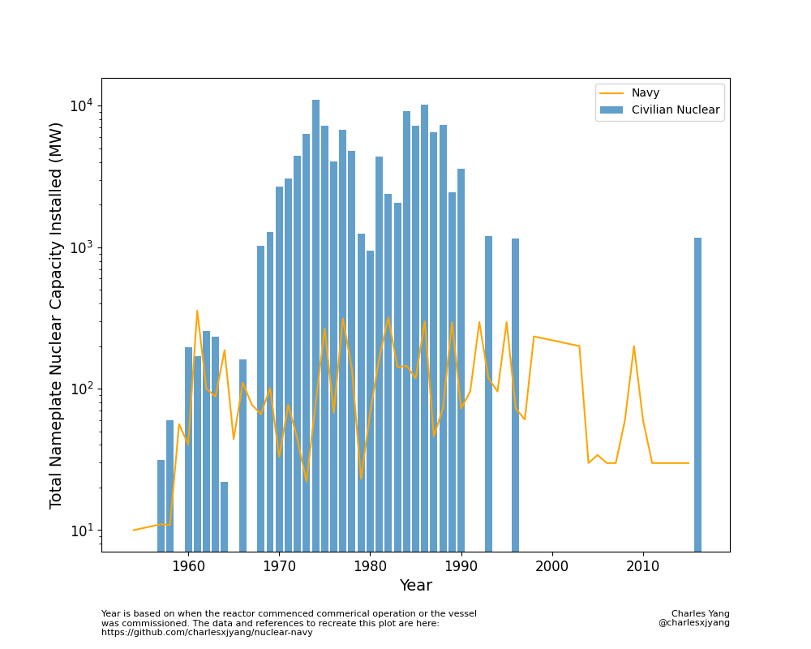
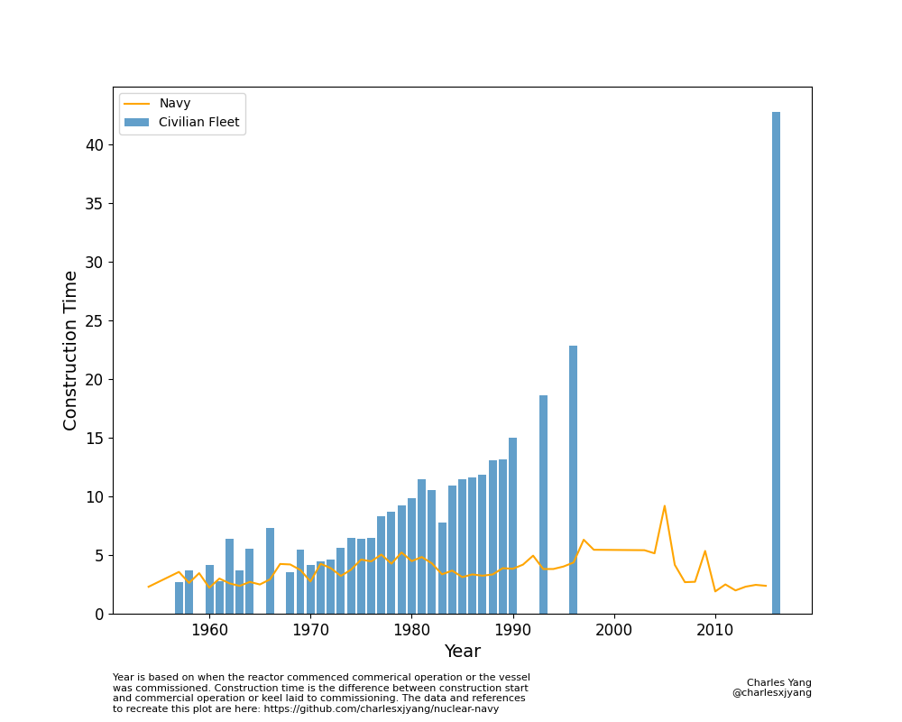

# Nuclear Navy

This repo compares the civilian nuclear fleet with the nuclear navy fleet. I plot the nameplate built capacity for nuclear reactors by year and construction time for the US civilian nuclear fleet with the US Navy's. These plots aim to show in a simple and visual manner that the US Navy is actually a significant procurer and producer of nuclear reactors and represents an organization we can learn much from about how to safely build and deploy large amounts of nuclear power.

## Nuclear Nameplate Capacity

## Nuclear Construction Time

